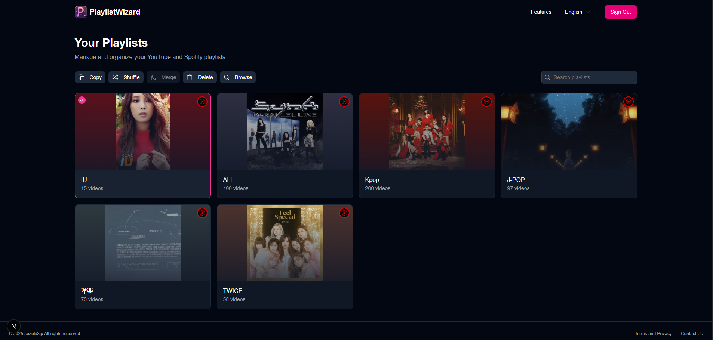

# 🎵 PlaylistWizard
🚀 Get started with your playlist management at [playlistwizard.suzuki3.jp](https://playlistwizard.suzuki3.jp)

# 🤔 What is PlaylistWizard?
PlaylistWizard is a website for managing and organizing your playlists.

# ✨ Key Features
- 🎯 **Intuitive Interface**: User-friendly GUI for managing your playlists
- 🛠️ **Playlist Management**: Copy, shuffle, merge, extract, and delete your playlists
- 🔍 **Playlist Browser**: Search and browse through your playlist items
- 📥 **Import Features**: Import playlists owned by other users
- 🌐 **Multi-Platform**: Supports multiple platforms (YouTube, YouTube Music, Spotify)
- 🌍 **Localization**: Available in multiple languages (English, Japanese)

# 🚀 Roadmap
- [ ] Cross-service playlist transfer
- [ ] Support for additional platforms

💡 Have an idea for a new feature? Feel free to submit an [issue](https://github.com/suzuki3jp/playlistwizard/issues/new)!